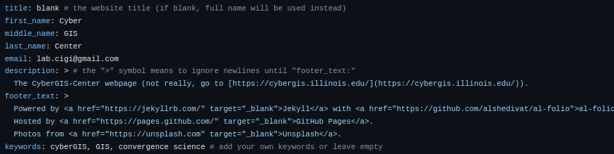
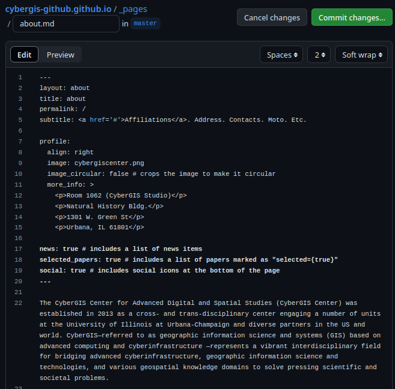
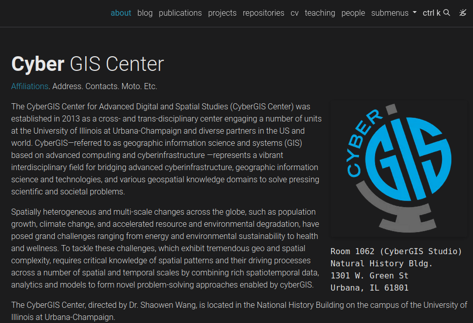

# Basic Customization

While we have deployed *a* webpage, it is definitely not *your* webpage yet. The next few steps will walk through some basic changes to help make the webpage your own.

## Updating _config.yml (again)

Back on the GitHub repository page, we will edit the `_config.yml` file once more. 

In the editor, let's make the following changes:

* Change `first_name`, `middle_name` (leave blank if desired), and `last_name` to your names.
* Change `email` to your email
* Edit the `description` as appropriate.
* Change `keywords`.


Scroll down the file to the "Social Integration" section (lines 74+ at time of writing). Here, we can enter in social media accounts (GitHub, Google Scholar, ACM, LinkedIn, ORCID) you would like to link with your account.

Feel free to change anything else you might see that interests you. When you are done, commit the changes.

!!! note
    These changes will not be reflected on your webpage immediately, the actions need to run. You may also need to clear any browser cache to see the changes when they have been deployed.

## Add a Profile Pic

Images on the webpage are in the `assets/img` folder of the repository. Navigate to this folder and click "Add file"/"Upload file" in the top-right. 

Upload a file and make note of the image file name including the file extension (mine is "cybergiscenter.png").

## Updating the About Page

The main pages for your site are in the `_pages` folder of your repository, with the `about.md` page being the landing page for your site. Navigate to this page and edit it.

A few things to edit:

* Change the `subtitle` as you see fit. 
* Change `image` to your profile image from the previous step (e.g. "cybergiscenter.png").
* Change `more_info` to whatever you want (e.g. your office address, leave it blank).
* Change the bio paragraphs to something more fitting.



When you are done editing, commit your changes. Remember that you need the actions to build and may need to update your cache to view the changes.



## Adding Papers


You can easily add your own papers to your website using [BibTeX](https://www.bibtex.org/) files. The bibiographies are automatically generated using these files and sorted in `_bibliography/papers.bib`. 

Navigate to this page and edit it. We will select the contents of the file and delete them. Then replace them with the following BibTeX entries (or your own!). Once you have made this change, commit the changes.

``` latex linenums="1"
@article{park_daily_2023,
  title = {Daily Changes in Spatial Accessibility to {{ICU}} Beds and Their Relationship with the Case-Fatality Ratio of {{COVID-19}} in the State of {{Texas}}, {{USA}}},
  author = {Park, Jinwoo and Michels, Alexander and Lyu, Fangzheng and Han, Su Yeon and Wang, Shaowen},
  year = {2023},
  month = mar,
  journal = {Applied Geography},
  pages = {102929},
  issn = {0143-6228},
  doi = {10.1016/j.apgeog.2023.102929},
  keywords = {Case-fatality ratio,COVID-19,Healthcare resources,Spatial accessibility}
}

@inproceedings{michels_impacts_2023,
  title = {Impacts of Catchments Derived from Fine-Grained Mobility Data on Spatial Accessibility},
  booktitle = {12th International Conference on Geographic Information Science ({{GIScience}} 2023)},
  author = {Michels, Alexander and Park, Jinwoo and Li, Bo and Kang, Jeon-Young and Wang, Shaowen},
  editor = {Beecham, Roger and Long, Jed A. and Smith, Dianna and Zhao, Qunshan and Wise, Sarah},
  year = {2023},
  month = sep,
  series = {Leibniz International Proceedings in Informatics ({{LIPIcs}})},
  volume = {277},
  pages = {52:1--52:6},
  publisher = {Schloss Dagstuhl -- Leibniz-Zentrum f{\"u}r Informatik},
  address = {Dagstuhl, Germany},
  issn = {1868-8969},
  doi = {10.4230/LIPIcs.GIScience.2023.52},
  abbr = {GIScience},
  confpaper = {true},
  isbn = {978-3-95977-288-4},
}

@article{michels_easysciencegateway_2023,
  title = {{{EasyScienceGateway}}: {{A}} New Framework for Providing Reproducible User Environments on Science Gateways},
  shorttitle = {{{EasyScienceGateway}}},
  author = {Michels, Alexander and Padmanabhan, Anand and Li, Zhiyu and Wang, Shaowen},
  year = {2023},
  journal = {Concurrency and Computation: Practice and Experience},
  volume = {36},
  number = {4},
  pages = {e7929},
  issn = {1532-0634},
  doi = {10.1002/cpe.7929},
  keywords = {computational reproducibility,cyberGIS,Jupyter,science gateway}
}

@article{michels_cybergis-compute_2024,
  title = {{{CyberGIS-Compute}}: {{Middleware}} for Democratizing Scalable Geocomputation},
  shorttitle = {{{CyberGIS-Compute}}},
  author = {Michels, Alexander C. and Padmanabhan, Anand and Xiao, Zimo and Kotak, Mit and Baig, Furqan and Wang, Shaowen},
  year = {2024},
  month = may,
  journal = {SoftwareX},
  volume = {26},
  pages = {101691},
  issn = {2352-7110},
  doi = {10.1016/j.softx.2024.101691},
  keywords = {CyberGIS,High-performance computing,Middleware,Scientific workflow}
}

@article{michels_spastc_2024,
  title = {{{SPASTC}}: A {{Spatial Partitioning Algorithm}} for {{Scalable Travel-time Computation}}},
  shorttitle = {{{SPASTC}}},
  author = {Michels, A. C. and Park, J. and Kang, J.-Y. and Wang, S.},
  year = {2024},
  journal = {International Journal of Geographical Information Science},
  volume = {0},
  number = {0},
  pages = {1--22},
  publisher = {Taylor \& Francis},
  issn = {1365-8816},
  doi = {10.1080/13658816.2024.2326445},
  keywords = {Accessibility,cyberGIS,parallel computing,spatial domain decomposition}
}
```

I recommend using Zotero with the [Better BibTeX for Zotero](https://retorque.re/zotero-better-bibtex/) plugin for working with BibTeX. BibTeX is also used for writing documents in LaTeX (e.g. Overleaf) so it is a useful tool!

Many journals also have an option to export the BibTeX citation.

## Delete a Page

You can remove and add pages to the `_pages` folder. For example, you can go to `_pages/profiles.md` and use the "..." menu to "Delete file".

This page is useful for labs/groups with multiple peope, but is not designed for personal webpages (although you can keep it if you want).


For more in-depth information on Customization, see the [instructions on the al-folio repo](https://github.com/alshedivat/al-folio/blob/master/CUSTOMIZE.md).