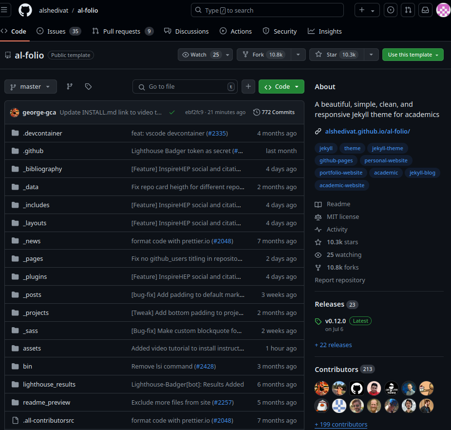
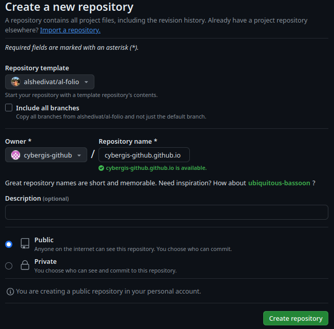
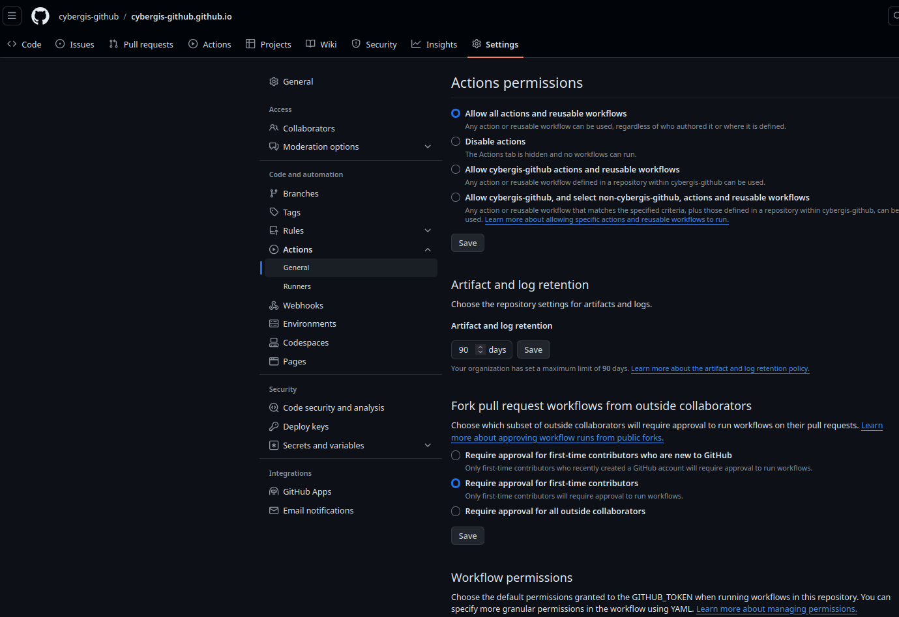
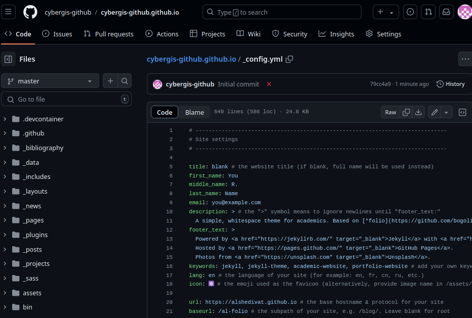
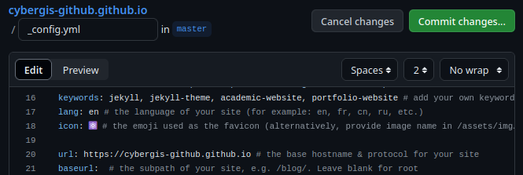
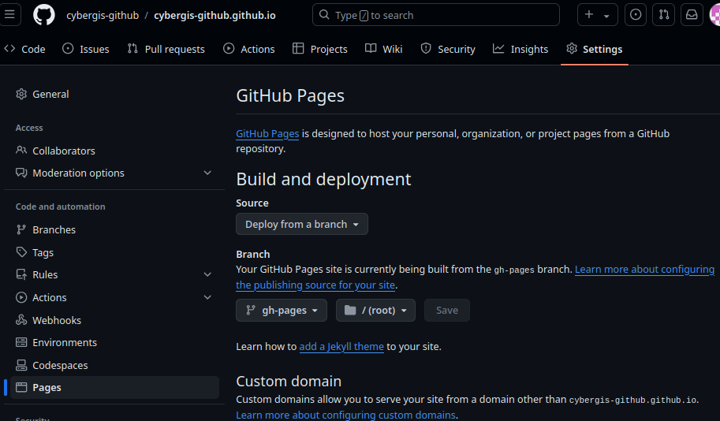
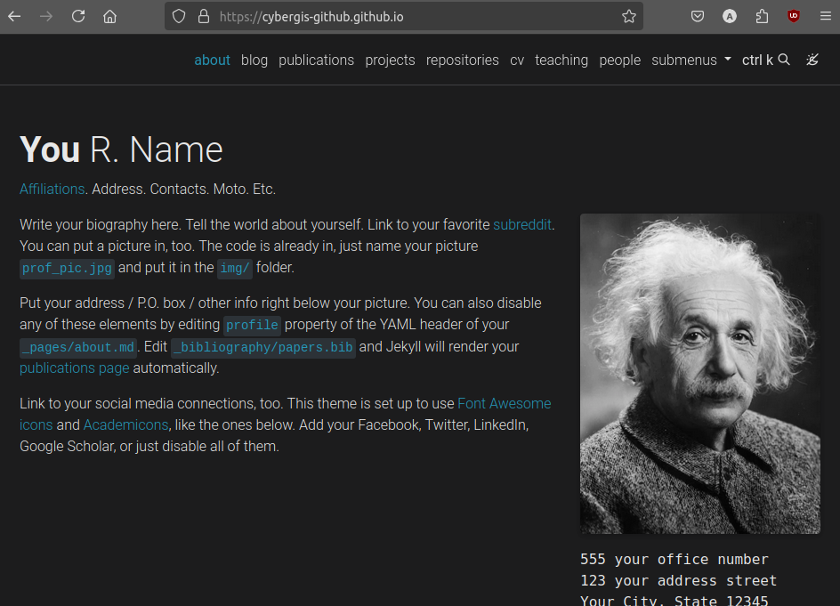

# Basics

## What is Al-Folio?

Al-folio is a [Jekyll]() theme and a template for deploying websites, with an emphasis on academic portfolios. By default, it supports:

* Blogging
* Curriculum Vitae
* Repositories
* News/Updates
* Projects
* Publications

[Check out the sample site here.](https://alshedivat.github.io/al-folio/)

## Creating Your Repo From a Template

This section of the tutorial will walk through the very basics by forking the al-folio repository and deploying it.

!!! warning
    You must have a GitHub account and must be signed in for this portion of the tutorial.

Go to the al-folio GitHub repository at [https://github.com/alshedivat/al-folio](https://github.com/alshedivat/al-folio).

In the top-right you should see a button that says "Use this template" then "Create a new repository".

If you plan to upload your site to `<your-github-username>.github.io`

!!! warning
    Note that the name of your repository ⚠️ MUST BE ⚠️ `<your-github-username>.github.io` or `<your-github-orgname>.github.io`, as stated in the [GitHub pages docs](https://docs.github.com/en/pages/getting-started-with-github-pages/about-github-pages#types-of-github-pages-sites).

When you have correctly set the name of the repository, click "Create Repository".

## Enabling Workflows and Updating Config

When you have your new repository, we then need to enable the "Workflow Permissions". This will allow GitHub to automatically run workflows within our repository. To do this:

* In the repo, select "Settings"
* In Settings, Select "Actions" on the left sidebar, then "General".
* Scroll down to "Workflow Permissions" and select "Read and write permissions".
* Click "Save".

Next, we need to make a small change to the configuration. 

1. Go to the "Code" tab on your repository.
2. Select the file "_config.yml".
3. In the top-right there should be a pen icon button with the tooltip "Edit this file", click this button.

4. Edit the line that says `url: http...` to be `url: http://<YOUR-GITHUB-USERNAME>.github.io/` filling in your GitHub username.
5. Edit `baseurl: /...` by leaving the line blank so it just reads `baseurl: `. You can leave the comment there (the `# the subpath...` portion).

6. When you are ready, click the "Commit Changes..." button and then "Commit changes".

While the website builds, let's talk about what we just did!

**What is a commit?** A Commit is Git's term for a "bundle of changes". Git keeps a record of your commits (changes), allowing you to see what you've changed with each new version of your code and go back to previous versions if necessary.

**What are GitHub Workflows?** Workflows are configurable automated processes that can be used with GitHub repositories to perform a variety of tasks. [More information Github Workflows](https://docs.github.com/en/actions/writing-workflows/about-workflows).

**What workflows are we using?** Workflows are defined using YAML (YAML Ain't Markup Language) files and (currently) must be put in a repository at `.github/workflows/` folder. Our workflows are performing a variety of tasks, but mostly compiling our website.

**What else can workflows do?** Almost anything within reason (e.g. low computation burden). A few things we have used them for:

* Deploying websites
* Checking the status of websites ([example](https://cybergis.github.io/upptime-monitoring/))
* Linting (automated code quality checking)
* Testing (automated code correctness checking)

**Did our workflow work?** You can check the "Actions" tab of the repo to see if your workflows ran or failed, and check individual jobs to view their outputs.

Once the "Deploy site" action has run successfully, we can deploy to GitHub pages! When this job is done, you should have a "gh-pages" branch on your repo.

## Deploying to GitHub Pages

With our configurations updated and the "gh-pages" branch created, we can do the last few steps to view our (unconfigured) webpage.

To deploy:

* Go to "Settings" in your repository.
* In the left side-bar, select "Pages".

* Under "Build and deployment" select "Deploy from a branch" in the "Source" dropdown.
* Under "Branch" select "gh-pages" in the dropdown and click "Save".

When you have done this, you should be able to see a "pages-build-deployment" action running in your "Actions" tab.

When the action is done, you can navigate to your webpage at: https://<username>.github.io

*This portion of the tutorial is based on the [al-folio Installation Docs](https://github.com/alshedivat/al-folio/blob/master/INSTALL.md).*